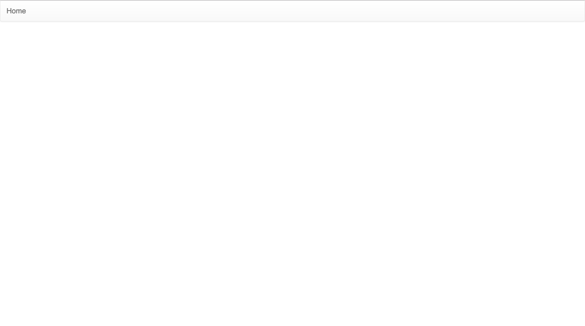
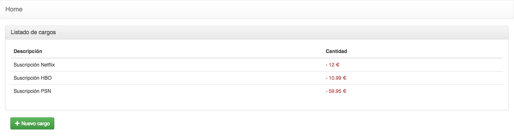
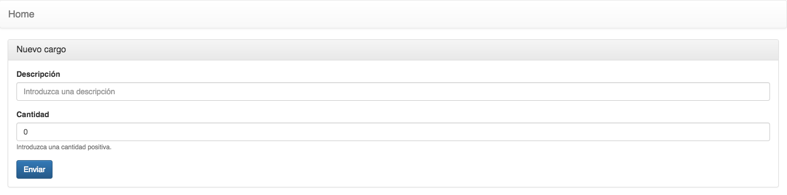

## Synopsis

Simple app example using Express.JS (server-side) and React JS (client-side). Database models are managed by Sequelize (promise based ORM).

## Folder structure

This project is simple, there are two folders inside "bank-app":

1. bank-app-server (back-end).
2. bank-app-client (front-end).

```
bank-app
├── LICENSE.md
├── README.md
├── bank-app-client
|  ├── package.json
|  ├── public
|  |  ├── favicon.ico
|  |  ├── index.html
|  |  └── manifest.json
|  └── src
|     ├── App.css
|     ├── App.js
|     ├── App.test.js
|     ├── Create.js
|     ├── Header.js
|     ├── Home.js
|     ├── index.css
|     ├── index.js
|     └── registerServiceWorker.js
├── bank-app-server
|  ├── app.js
|  ├── bin
|  |  └── www
|  ├── config
|  |  └── config.json
|  ├── fixtures
|  |  └── data.json
|  ├── models
|  |  ├── charge.js
|  |  └── index.js
|  ├── npm-debug.log
|  ├── package.json
|  └── routes
|     └── api.js
└── images
   ├── create.png
   ├── list.png
   └── main.png
```

## Dependencies

* npm - [3.10.8](https://docs.npmjs.com/getting-started/installing-node)
* node - [v6.11.3](https://nodejs.org/es/download/)

## Installation guide

This tutorial is only for UNIX systems.
Server side will run on port 3001 and client side on port 3000 to avoid conflicts and simulate two diferent environments.

1. Config database parameters:

	Edit the config file ```bank-app/bank-app-server/config.json``` and change default parameters to your own project parameters:

	```
	{
		"development": {
			"username": "root",
			"password": "password",
			"database": "development-database",
			"dialect": "sqlite"
		},
		"test": {
			"username": "root",
			"password": "password",
			"database": "test-database",
			"dialect": "sqlite"
		},
		"production": {
			"username": "root",
			"password": "password",
			"database": "production-database",
			"dialect": "sqlite"
		}
	}

	```

2. Start the server side application:

	Open terminal from bank-app folder:


	```
	cd bank-app-server
	npm install
	npm start
	```


	Once server has started, the console should show a message like this:


	```
	npm start

	> bank-app@0.0.0 start /private/var/www/html/bank-app/bank-app-server
	> node ./bin/www

	Executing (default): CREATE TABLE IF NOT EXISTS `charge` (`id` INTEGER PRIMARY KEY AUTOINCREMENT, `description` VARCHAR(255) NOT NULL, `amount` FLOAT NOT NULL, `created_at` DATETIME NOT NULL, `updated_at` DATETIME NOT NULL);
	Executing (default): PRAGMA INDEX_LIST(`charge`)
	Fixtures: reading file fixtures/data.json...
	Executing (default): SELECT `id`, `description`, `amount`, `created_at`, `updated_at` FROM `charge` AS `Charge` WHERE `Charge`.`description` = 'Suscripción Netflix' AND `Charge`.`amount` = 12 LIMIT 1;
	Executing (default): INSERT INTO `charge` (`id`,`description`,`amount`,`created_at`,`updated_at`) VALUES (NULL,'Suscripción Netflix',12,'2019-04-25 11:45:25.744 +00:00','2019-04-25 11:45:25.744 +00:00');
	Executing (default): SELECT `id`, `description`, `amount`, `created_at`, `updated_at` FROM `charge` AS `Charge` WHERE `Charge`.`description` = 'Suscripción HBO' AND `Charge`.`amount` = 10.99 LIMIT 1;
	Executing (default): INSERT INTO `charge` (`id`,`description`,`amount`,`created_at`,`updated_at`) VALUES (NULL,'Suscripción HBO',10.99,'2019-04-25 11:45:25.756 +00:00','2019-04-25 11:45:25.756 +00:00');
	Executing (default): SELECT `id`, `description`, `amount`, `created_at`, `updated_at` FROM `charge` AS `Charge` WHERE `Charge`.`description` = 'Suscripción PSN' AND `Charge`.`amount` = 59.95 LIMIT 1;
	Executing (default): INSERT INTO `charge` (`id`,`description`,`amount`,`created_at`,`updated_at`) VALUES (NULL,'Suscripción PSN',59.95,'2019-04-25 11:45:25.759 +00:00','2019-04-25 11:45:25.759 +00:00');

	```

	The server will initialize automatically the database (drop and sync) and fixtures will be loaded from ```bank-app-server/fixtures/data.json```.


3. Start the client side application:

	Open terminal and bank-app folder:


	```
	cd bank-app-client
	npm install
	npm start
	```


	Once client has started, the console should show a message like this:


	```
	Compiled successfully!

	You can now view bank-app-client in the browser.

	  Local:            http://localhost:3000/
	  On Your Network:  http://192.168.1.78:3000/

	Note that the development build is not optimized.
	To create a production build, use npm run build.
	```


	You will be redirected to ```http://localhost:3000/``` on your default browser.

## User guide

At the begining, home blank page will be rendered.



If "Home" button is clicked, a list of preloaded charges will be shown.



The user can add a new charge by clicking on "Nuevo cargo" button.




## Authors

* **Esteban Martín Busto**

## License

This project is licensed under the MIT License - see the [LICENSE.md](LICENSE.md) file for details

